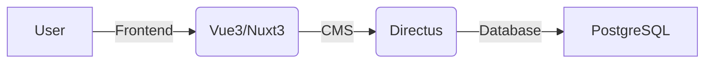
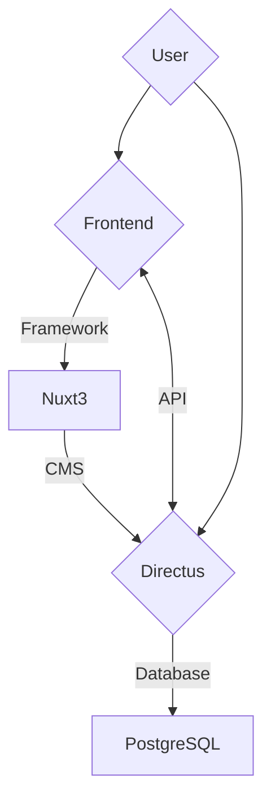

<div align="center">

# Digital Task-Tracking Platform


</div>

# Table of Contents

- [Introduction](#introduction)
  - [Features](#features)
  - [Use Cases](#use-cases)
- [Architecture](#architecture)
    - [Traffic Flow](#traffic-flow)
- [Frontend](#frontend)
    - [Prerequisites](#prerequisites)
    - [Installation](#installation)
    - [Configuration](#configuration)
    - [Usage](#usage)
- [Docker](#docker)
    - [Prerequisites](#prerequisites-1)
    - [Configuration](#configuration-1)
    - [Usage](#usage-1)
- [Deployment](#deployment)
    - [Prerequisites](#prerequisites-2)
        - [Server](#server)
        - [Software](#software)
    - [Configuration](#configuration-2)
    - [CI/CD](#cicd)
        - [Configuration](#configuration-3)
- [Contributing](#contributing)
- [License](#license)

## Introduction

Taskimatti is a digital task-tracking platform for organizations, companies, public institutions, and communities.
It is a web application built with Vue 3 and Nuxt 3. The application uses Directus as a headless CMS and PostgreSQL as a
database. The application is deployed with Docker. The application is licensed under the AGPL-3.0 License.

### Features

1. **Project Creation and Management**: Taskimatti allows organization administrators to create and manage projects.
   Taskimatti provides flexible project settings, allowing admins to either accept all users or manually accept selected
   users to join the project. Admins can also customize the project's color scheme and logo.
2. **Task Creation**: Administrators can create tasks within projects. When a task is created, the admin can decide if
   the task can be completed by the user directly or if it needs to be validated by a project moderator by scanning a QR
   code.
3. **User Participation and Task Completion**: Once user is accepted to the project, they can start completing tasks.
   Each task completion is individual and contributes to the user's total score. The completion process depends on the
   task's settings.
4. **Scoring and Competition**: Taskimatti introduces a scoring system based on individual task completions, fostering a
   competitive environment among users. This healthy competition motivates users to complete tasks and earn points,
   aiming for a higher position on the leaderboard.
5. **User Profiles**: Taskimatti provides users with personal profiles where they can track their individual task
   completions and accumulated points. Users can edit their personal information and privacy settings.

### Use Cases

- **Educational Institutions**: Schools and universities could use Taskimatti to manage and track assignments or
  projects. It could also be used to gamify learning, where students earn points for completing educational tasks or
  achieving academic milestones.
- **Non-Profit Organizations**: Non-profits could use Taskimatti to manage and track volunteer activities. Volunteers
  could earn points for completing tasks, which could potentially be used for rewards or recognition.
- **Corporate Businesses**: Companies could use Taskimatti for project management, employee engagement, and team
  building. Tasks could be work-related or could be part of a wellness program, where employees earn points for
  participating in healthy activities.
- **Government Agencies**: Government agencies could use Taskimatti to manage and track internal projects or community
  outreach programs. For example, a city council could use it to manage a city beautification project, where community
  members earn points for participating in clean-up or beautification tasks.
- **Event Organizers**: Event organizers could use Taskimatti to manage and track tasks related to event planning and
  execution. This could include tasks for staff, volunteers, or even attendees (like a scavenger hunt or other
  interactive activities).
- **Healthcare Institutions**: Hospitals or healthcare organizations could use Taskimatti to manage and track tasks
  related to patient care or internal operations. It could also be used for training purposes, where healthcare
  professionals earn points for completing training modules or achieving certain competencies.

## Architecture



### Traffic Flow



## Development

### Frontend

#### Prerequisites

- [Node.js](https://nodejs.org/en/) (v18.0.0)

#### Installation

```bash
# Clone the repository
git clone https://github.com/taskimatti/taskimatti.git
# Change directory
cd taskimatti/app
# Install dependencies
npm install
```

#### Configuration

Copy `.env.example` to `.env` and fill in the required values.

```bash
cp .env.example .env
```

- `NUXT_API_URL` is the URL of the Directus CMS.
- `NUXT_API_EMAIL` is the email of the Directus admin user.
- `NUXT_API_PASSWD` is the password of the Directus admin user.

#### Usage

```bash
# Start development server
npm run dev

# Build for production
npm run build
# Start production server
npm run start
```

### Docker

We use Docker to run the application in a containerized environment.

#### Prerequisites

- [Docker](https://www.docker.com/) (v20.10.8)

#### Configuration

Copy `.env.example` file in the app directory and rename it to `.env`.

Copy `example.env.prod.db` to `.env.prod.db`.

Copy `example.env.prod` to `.env.prod`.

```bash
cp ./app/.env.example ./app/.env
cp example.env.prod.db .env.prod.db
cp example.env.prod .env.prod
```

Replace the values in the files with the correct values.

#### Usage

```bash
# Start the application
docker compose -f compose.yaml up -d --build
# Stop the application
docker compose -f compose.yaml down

# Start service
docker compose -f compose.yaml start <service>
# Stop service
docker compose -f compose.yaml stop <service>

# Inspect logs of service
docker compose -f compose.yaml logs -f <service>

# Get a shell to a service
docker compose -f compose.yaml exec <service> sh

# Stop and remove containers, networks, images, and volumes
docker compose -f compose.yaml down -v
```

## Deployment

### Prerequisites

#### Server

Ubuntu 22.04 LTS (introductions are based on this version)

#### Software

- [Docker](https://www.docker.com/) (v24.0.7 or newer)
- [Nginx](https://www.nginx.com/) (v1.18.0)
- [Certbot](https://certbot.eff.org/) (v1.21.0)

#### Configuration

```bash
# Create a new user with home directory
sudo adduser --home /home/taskimatti --disabled-password taskimatti
# Add the user to the docker group
sudo usermod -aG docker taskimatti

# Generate ssh key pair
ssh-keygen -t rsa -b 4096 -C "taskimatti"
# Copy the private key for CI/CD
cat /home/taskimatti/.ssh/id_rsa

# Clone the repository
git clone https://github.com/taskimatti/taskimatti.git

# Configure nginx reverse proxy
sudo cp deploy/example.com /etc/nginx/sites-available/taskimatti
# Change example.com to your domain
sudo sed -i 's/example.com/yourdomain.com/g' /etc/nginx/sites-available/taskimatti
# Enable the site
sudo ln -s /etc/nginx/sites-available/taskimatti /etc/nginx/sites-enabled/
# Get SSL certificates
sudo certbot --nginx -d yourdomain.com -d cms.yourdomain.com

# Configure ufw firewall
sudo ufw allow 8080; sudo ufw allow 8081; sudo ufw allow 22
sudo ufw enable

# Configure environment variables
cd /home/taskimatti/taskimatti
cp ./app/.env.example ./app/.env
cp example.env.prod.db .env.prod.db
cp example.env.prod .env.prod
# Replace the values in the files with the correct values
````

### Usage

```bash
# Start the application
docker compose -f compose.yaml up -d --build

# Import the database and files
sh ./directus/import.sh
```

### CI/CD

We use GitHub Actions to build and deploy the application. The workflow is defined in
the [.github/workflows/ci.yml](.github/workflows/ci.yaml) file.

#### Configuration

You need to set the following secrets in your repository secrets:

| Secret     | Description                                   |
|------------|-----------------------------------------------|
| `HOST`     | IP address of your server                     |
| `PORT`     | SSH port of your server                       |
| `USERNAME` | Username for your server                      |
| `PASSWORD` | Password for your server                      |
| `KEY`      | SSH private key                               |
| `PROD`     | Environment variables for Directus            |
| `PROD_DB`  | Environment variables for PostgreSQL database |
| `ENV`      | Environment variables for Nuxt                |

`Prod`, `prod_db`, and `env` are the contents of the `.env.prod`, `.env.prod.db`, and `./app/.env` files, respectively.

## Contributing

Select an issue from the [issues](https://github.com/taskimatti/taskimatti/issues) page and assign yourself to it.
Create a new branch from the `main` branch and name it `issue-<issue number>`.

When you have finished your work, ensure that the code is formatted with [Prettier](https://prettier.io/) by running the
following command:

```bash
npm run format
```

Then create a pull request to the `dev` branch. The pull request will be reviewed by the project maintainers.

You can also create a new issue if you have an idea for a new feature or a bug fix.

## License

This project is licensed under the AGPL-3.0 License - see the [LICENSE](LICENSE) file for details.
