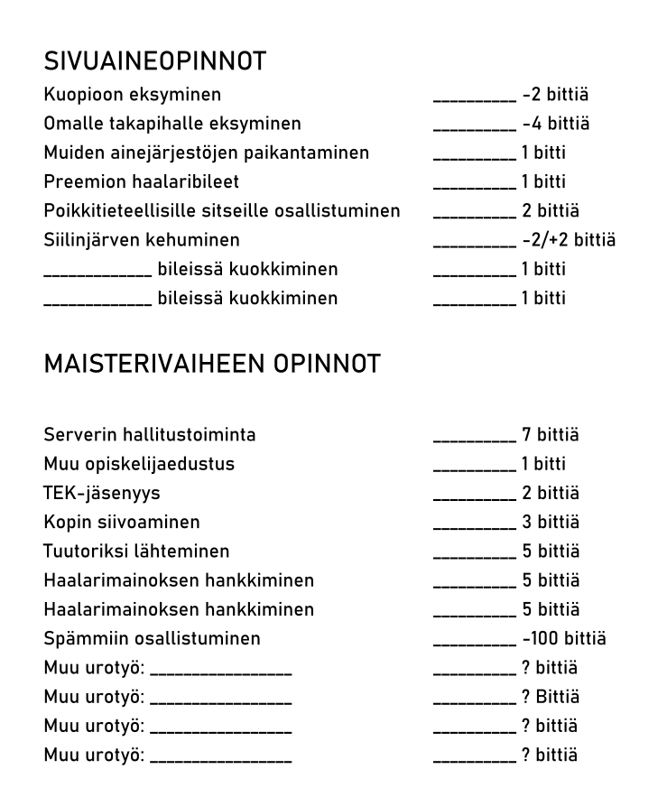
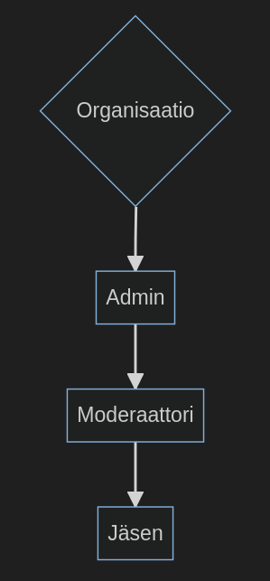

# Fuksipassi

##### Digitaalinen suoritusten seuranta-alusta

## Ongelma ja ratkaisu

### Taustaa

Perinteisessä fuksipassissa, ensimmäisen vuoden opiskelijat suorittavat tuutorien laatimia tehtäviä.

Vain tuutorit voivat merkata tehtävän suoritetuksi.

Fuksit kilpailevat keräämällä pisteitä suorituksista.

### Ongelma

Fuksipassi on paperinen
- Katoaa helposti
- Voi kastua tai muuten pilaantua
- Unohtuu kotiin
- Ei voida päivittää
- Voidaan väärentää
- Suuri määrä paperia tulostettava ja jaettava

### Digitaalinen alusta

- Helpottaa fuksipassin tekoa
    - Tehtäviä voi lisätä ja muokata jatkuvasti
- Reaaliaikainen pisteidenseuranta
    - Kilpailua!
- Parantaa käyttökokemusta
    - Suoritusten todentaminen
    - Kulkee aina mukana
    - Tiedot turvassa vedeltä ja kadottamiselta

## Käyttäjätasot

### Hierarkia
 

Suoritusten seuranta-alusta (vas.) sähköinen fuksipassi (oik.)

## Organisaatio

- Voi lisätä itsensä alustalle
- Lisää itselleen ylläpitäjiä ja moderaattoreita
- Käyttäjät tunnistavat organisaation QR-koodista tai linkistä

### Ylläpitäjä

- Ylläpitäjillä eli admineilla on suurin valta organisaatiossa
- Lisäävät ja poistavat tapahtumia, moderaattoreita ja jäseniä
- Voivat muokata organisaation tietoja

### Moderaattori

- Voi lisätä ja poistaa jäseniä ja validoida jäsenien tekemiä suorituksia
- Tyypillisesti tuutori tai muu vastuuhenkilö

###  Jäsen

- Pyytää lupaa liittyä organisaatioon tai saa kutsun sinne
- Jäsen suorittaa tehtäviä ja pyytää suoritusmerkinnät niistä
- Jäsen voi seurata muiden käyttäjien edistystä tulostaulun kautta

## Jatkokehitys

#### Yhtä fuksipassia laajempi kokonaisuus

### Sähköinen alusta

- Rastipassi 
- Liikuntapassi
- Lajikokeilupassi
- Turistipassi
- Koulutuspassi

Note: Kouluihin, työpaikoille, yhdistyksille, järjestöille, tapahtumiin, festareille, kaupunkeihin, maakuntiin, valtioille, jne. Pesonen Juho matkailu

## Tulevaisuus

Pilotoidaan 2024 keväällä UEFin tietojenkäsittelytieteen opiskelijoilla ja syksyllä 2024 kaikilla uusilla TKT opiskelijoilla.

2025 laajennetaan muihin muille ainejärjestöille ja toimialueille.

Liikuntapassi pilotoidaan parin koululuokan kanssa. Pidetään mielessä myös Sykettä.

## Meidän tiimi

#### Tietojenkäsittelytieteen opiskelijat

## Skills

- Fullstack
- UI/UX
- CI/CD

## DEMO

## Käyttöliittymä

<iframe style="border: 1px solid rgba(0, 0, 0, 0.1);" width="800" height="450" src="https://www.figma.com/embed?embed_host=share&url=https%3A%2F%2Fwww.figma.com%2Fproto%2FgAtgXIcR4e21TgsjoxCaPV%2FFuksipassi-UI%3Ftype%3Ddesign%26node-id%3D38-45%26t%3DPVUNSHWaAbMhvKVm-1%26scaling%3Dscale-down%26page-id%3D0%253A1%26starting-point-node-id%3D38%253A45%26mode%3Ddesign" allowfullscreen></iframe>
